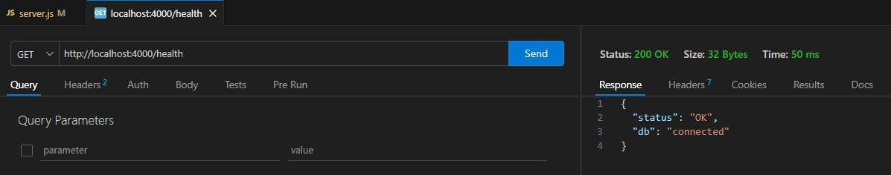
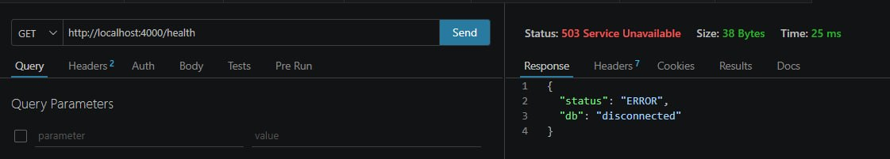
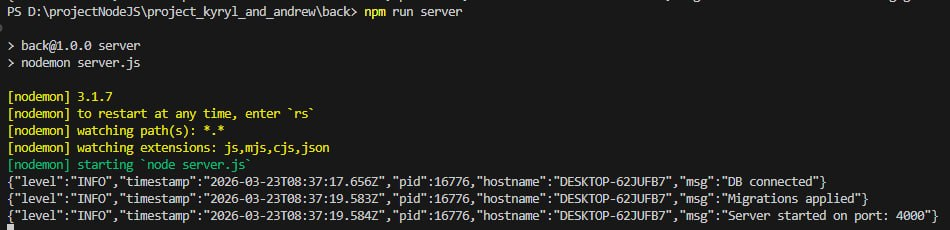
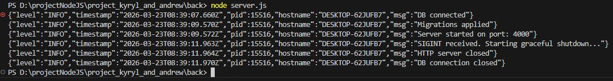
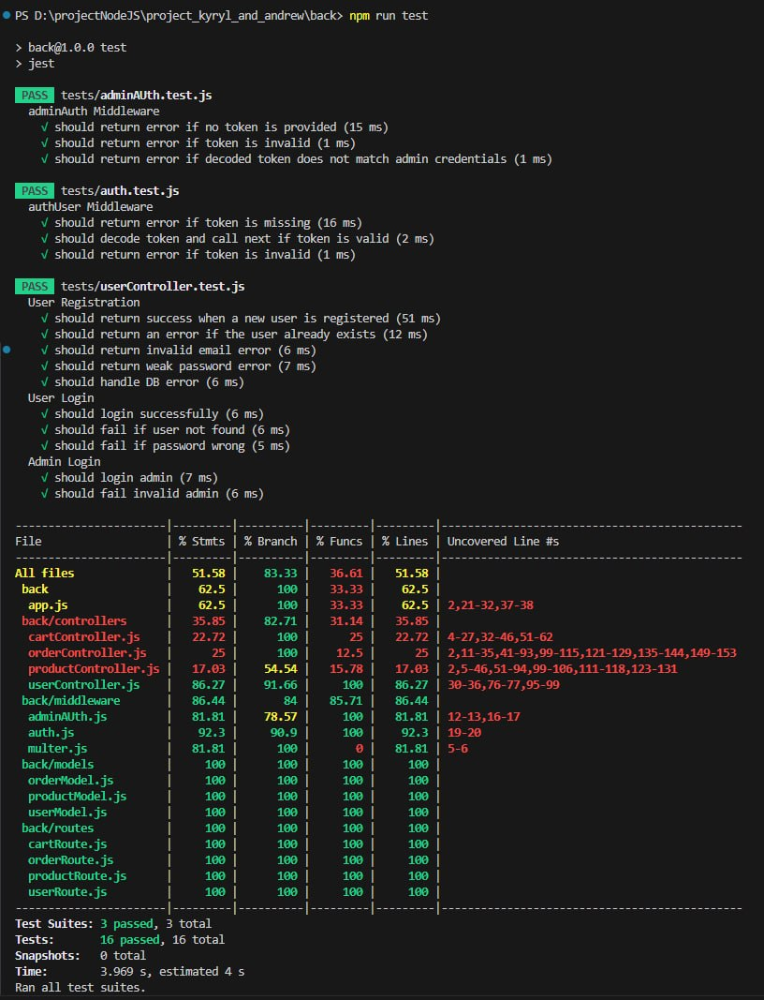

# Service Documentation: Health Check and Graceful Shutdown

This document provides instructions on configuring the application environment, monitoring its health, and verifying the safe shutdown mechanisms.

## Environment Variables Configuration

For the full functionality of all application modules, including media handling, authorization, and payments, the following variables must be added to your `.env` file:

**Database**

**MONGODB_URI**
The full connection string to your MongoDB cluster. It contains the server address and credentials required to store and retrieve all application data.

**Cloud Storage (Cloudinary)**

**CLOUDINARY_NAME**
Your cloud space identifier (Cloud name) in the Cloudinary system, which determines exactly where requests will be routed.

**CLOUDINARY_API_KEY**
The public access key for the Cloudinary API, used to identify your application when performing basic media operations.

**CLOUDINARY_SECRET_KEY**
The secret key for signing requests to Cloudinary. It is critical for the secure uploading, deleting, and transforming of images on the server side.

**Security and Authorization**

**JWT_SECRET**
A cryptographic key (a string of random characters) used to generate and verify JSON Web Tokens. This is the core of the authorization system, ensuring session integrity and protecting private API routes from unauthorized access.

**Access Control**

**ADMIN_EMAIL**
The email address for the initial administrator account. It is used for the initial database seeding.

**ADMIN_PASSWORD**
The password for the initial administrator account. For security reasons, it is highly recommended to change this password immediately after the first system deployment.

**Payment System**

**STRIPE_SECRET_KEY**
The secret key for backend integration with the Stripe payment gateway. It is necessary for creating checkout sessions, verifying transaction statuses, and securely processing financial operations.

---

## Health Check Verification

The system is equipped with a health check mechanism that responds directly to the database connection status.

### Successful Connection (Status 200)
Provided the application is running normally and the database connection is active, the endpoint returns a positive status. The output of the `curl -i localhost:4000/health` command is shown below:



### Database Failure (Status 503)
In the event of a manual database shutdown, the application correctly intercepts the state change and signals that the service is unavailable. The following screenshot demonstrates the request result after disconnecting the DB:



---
## Quick Start: One-Command Build

To simplify the deployment process and eliminate the need for manual environment configuration, this project supports a seamless initialization process. You can spin up the entire infrastructure, including the application server and the database, using a single command.



---

## Gracefull shutdown


---

## 1 command test


---

## Event Logging (Log Example)

A structured JSON format is used to record events, which simplifies subsequent automated and manual analysis. A snippet of the console output during application startup:

```json
{"level":30,"time":1774806929547,"pid":14680,"hostname":"DESKTOP-7N2FSER","msg":"DB connected"}
{"level":30,"time":1774806929548,"pid":14680,"hostname":"DESKTOP-7N2FSER","msg":"Cloudinary connected"}
{"level":30,"time":1774806931440,"pid":14680,"hostname":"DESKTOP-7N2FSER","msg":"Migrations applied"}
{"level":30,"time":1774806931444,"pid":14680,"hostname":"DESKTOP-7N2FSER","msg":"Server started on port: 4000"}
{"level":30,"time":1774806964783,"pid":14680,"hostname":"DESKTOP-7N2FSER","msg":"SIGINT received. Starting graceful shutdown..."}

{"level":30,"time":1774806982383,"pid":11680,"hostname":"DESKTOP-7N2FSER","msg":"DB connected"}
{"level":30,"time":1774806982383,"pid":11680,"hostname":"DESKTOP-7N2FSER","msg":"Cloudinary connected"}
{"level":30,"time":1774806984097,"pid":11680,"hostname":"DESKTOP-7N2FSER","msg":"Migrations applied"}
{"level":30,"time":1774806984099,"pid":11680,"hostname":"DESKTOP-7N2FSER","msg":"Server started on port: 4000"}


